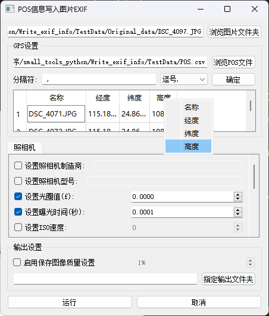

# WritePos2Exif
This tool can write the longitude, latitude and height information from the Pos text information into the Exif of the picture.



## 简介
WritePos2Exif 是一个工具，用于将POS文本信息中的经度、纬度和高度信息写入图片的Exif数据中。该工具支持批量处理图片，并允许用户自定义相机设置和输出图像质量。

## 功能
- 从POS文件中读取经纬度和高度信息。
- 将读取的信息写入图片的Exif数据中。
- 支持批量处理图片。
- 提供自定义相机设置选项，如相机制造商、型号、光圈值、曝光时间、ISO速度等。
- 允许用户设置输出图像的质量。
- 提供图形用户界面，方便用户操作。

## 使用方法

### 环境要求
- Python 3.8
- 需要安装的Python库：
  - pillow
  - piexif
  - PyQt5
  - numpy
  - pandas

### 安装依赖
在命令行中运行以下命令以安装所需的Python库：
```bash
pip install Pillow piexif PyQt5 pandas
```

### 运行程序
1. 克隆或下载此项目到本地。
2. 在命令行中导航到项目目录。
3. 运行以下命令启动应用程序：
   ```bash
   python main.py
   ```

### 使用步骤
1. 启动程序后，选择包含图片的文件夹。
2. 选择包含POS信息的文件（支持TXT、CSV、Excel格式）。
3. 设置POS文件的分隔符。
4. 在表格中查看和确认POS信息。
5. 选择相机设置和输出设置。
6. 点击“运行”按钮开始处理图片。

## 数据说明

### 数据格式
POS文件应包含以下信息：
- **经度**：图片拍摄位置的经度。
- **纬度**：图片拍摄位置的纬度。
- **高度**：图片拍摄位置的海拔高度。

参考格式如下：

```csv
DJI4071.JPG 115.187 24.861 1087.86 
DJI4072.JPG 115.188 24.860 1086.97
```

支持的文件格式包括TXT、CSV和Excel。每个文件应包含一行标题，后续行包含对应的数据。

### 数据来源
POS数据通常由GPS设备或其他定位设备生成。确保数据的准确性和完整性，以便正确写入Exif信息。

### 数据准备
1. 确保POS文件中的数据与图片文件名匹配。
2. 确保数据文件的格式正确，并包含必要的经度、纬度和高度信息。
3. 如果使用CSV或Excel文件，请确保数据分隔符设置正确。

## 界面说明

- **图片文件夹选择**：用于选择需要处理的图片文件夹。
- **POS文件选择**：用于选择包含经纬度和高度信息的POS文件。
- **分隔符设置**：用于设置POS文件中数据的分隔符，默认空格分隔。
- **相机设置**：提供多种相机参数设置选项。
- **输出设置**：允许用户设置输出图像的质量和输出文件夹。
- **运行和取消按钮**：用于开始或取消处理。

## 注意事项
- 确保POS文件中的名称与图片文件名匹配，以便正确写入Exif信息。
- 处理过程中请勿关闭程序窗口，以免中断操作。

## 许可证
该项目采用MIT许可证。详细信息请参阅LICENSE文件。
